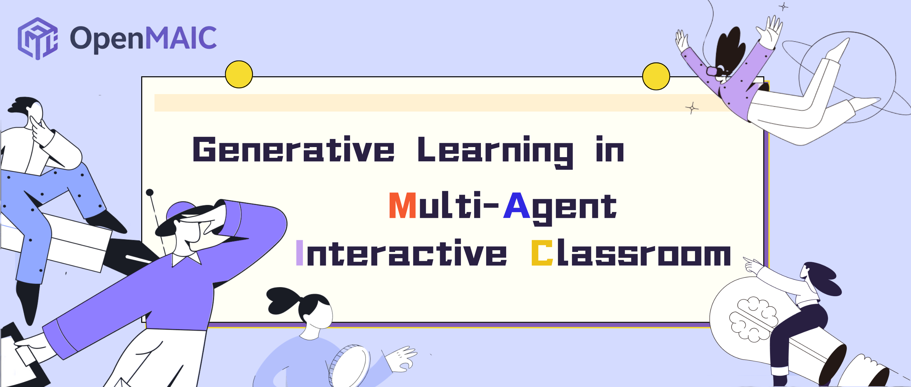
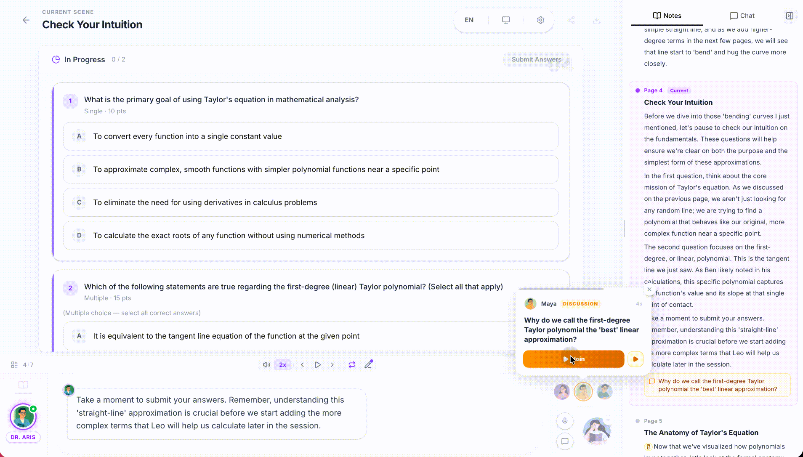
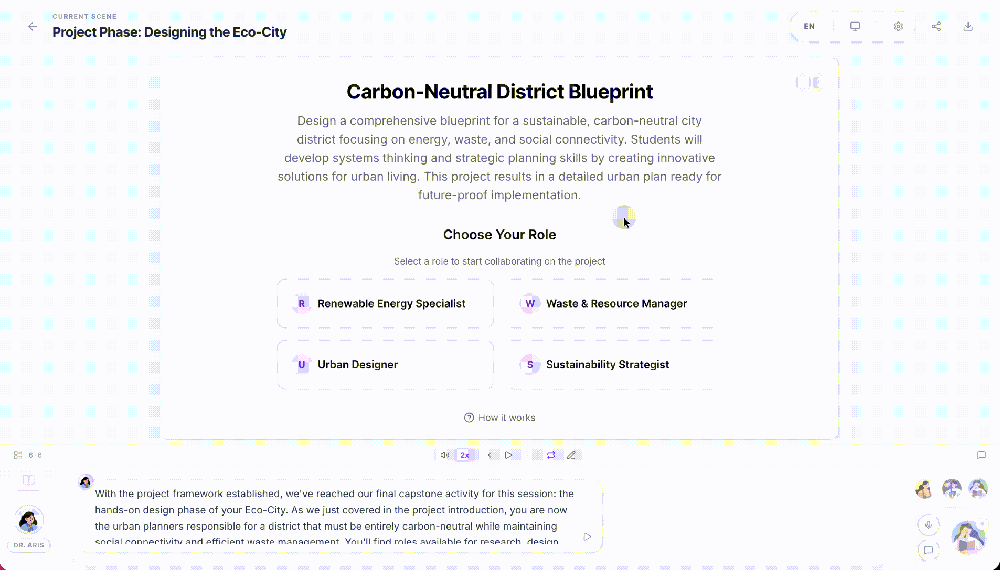
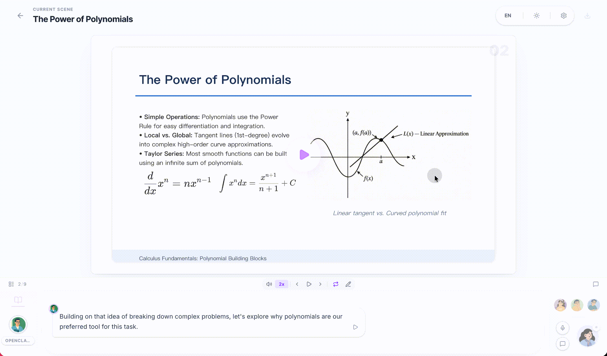

<p align="center">
  
</p>

<p align="center">
  <b>成长大师兄 · GrowthMentor</b><br/>
  AI Practice Arena — spar with multi-agent mentors, peers, and challengers
</p>

<p align="center">
  <a href="LICENSE"></a>
  
  
  
  
</p>

<p align="center">
  <a href="./README.md">English</a> | <a href="./README-zh.md">简体中文</a>
</p>

---

## Why 成长大师兄

Most AI learning tools **lecture**.  
**成长大师兄 (GrowthMentor) makes you practice.**

Give it a topic. It builds a practice room: mentors, teammates, and challengers at one roundtable. They ask, push back, cold-call, and sketch on a shared whiteboard. You jump in anytime — real dialogue pressure, not a one-way video.

<p align="center">
  
</p>

---

## Practice scenarios (the core)

| Scenario | You train | Agents do |
|----------|-----------|-----------|
| **Roundtable** | Presence, listening, live reaction | Multi-persona debate; join or get called on |
| **Attack / defend** | Argument structure, rebuttal | Opposing roles spar; whiteboard tracks claims |
| **Mentor grill** | Depth, problem framing | Q&A that keeps pressing with slides / board |
| **Quiz drills** | Recall + correction | Instant grade + explain; miss → retry |
| **PBL collab** | Ownership, shipping | Pick a role; hit milestones with AI teammates |

<p align="center">
  
  &nbsp;
  
</p>

### One round, end to end

1. **Set the brief** — e.g. *“Product review: score this feature and sell it to the PM”*  
2. **Cast the room** — mentor / skeptic / note-taker personas  
3. **Run the drill** — voice + whiteboard + roundtable; you can interrupt  
4. **Debrief** — quiz, notes, export — keep what you earned  

---

## Capabilities

- **Multi-agent orchestration** — LangGraph director schedules turns, cold-calls, max rounds  
- **Voice in / out** — TTS + ASR so practice is spoken, not only typed  
- **Shared whiteboard** — formulas, flows, argument maps while talking  
- **Scene generation** — topic / PDF → outline → slides / quiz / interactive / PBL  
- **Export** — editable `.pptx`, interactive `.html`  
- **i18n (zh/en)** · Dark mode · multi-provider LLMs  

<p align="center">
  
  &nbsp;
  
</p>

---

## Who it's for

| Audience | Typical drills |
|----------|----------------|
| Job / promo | Behavioral interview, system-design talk-through, promo narrative |
| Product / consulting | Spec review, objection handling, pitch dry-run |
| Students | Thesis defense rehearsal, concept grill, wrong-answer loops |
| Language learning | Role-play, situational talk, impromptu speaking |
| Team training | Sales scripts, compliance scenarios, incident postmortems |

---

## Quick start

**Need:** Node.js ≥ 20 · pnpm ≥ 10

```bash
git clone https://github.com/RobertHan215/growth-mentor.git
cd growth-mentor
pnpm install
cp .env.example .env.local
```

Put at least one LLM key in `.env.local`:

```env
OPENAI_API_KEY=sk-...
# or ANTHROPIC_API_KEY / GOOGLE_API_KEY / DEEPSEEK_API_KEY / ...
# recommended: DEFAULT_MODEL=google:gemini-3-flash-preview
```

```bash
pnpm dev
# → http://localhost:3000
```

Production:

```bash
pnpm build && pnpm start
# or
docker compose up --build
```

Vercel works too — import the repo, set one API key, deploy.

---

## Stack (short)

| Layer | Choice |
|-------|--------|
| App | Next.js 16 · React 19 · TypeScript |
| Orchestration | LangGraph multi-agent director |
| State | Zustand · SSE streaming chat |
| Stage | Slide canvas · SVG whiteboard · TTS/ASR |
| Ship | Node / Docker / Vercel |

Where practice lives:

```
app/api/chat/            # multi-agent practice SSE
app/api/generate*/       # scene generation pipeline
lib/orchestration/       # director graph / turn taking
lib/playback/            # playback ↔ live
lib/action/              # speech, whiteboard, discussion actions
components/roundtable/   # roundtable UI
components/chat/         # practice sessions
```

---

## OpenClaw (optional)

Spin up practice rooms from Feishu / Slack / Telegram via [OpenClaw](https://github.com/openclaw/openclaw):

```bash
clawhub install growth-mentor
```

Hosted or local walkthrough lives in `skills/growth-mentor/`.

---

## Contributing

Issues and PRs welcome. Touching practice flow? Start here:

- `lib/orchestration/` — who speaks, how many turns, cold-calls  
- `lib/action/` — discussion / speech / whiteboard actions  
- `components/roundtable/` + `components/chat/` — practice UI  

```bash
pnpm lint && pnpm test
```

---

## License

[AGPL-3.0](LICENSE)
